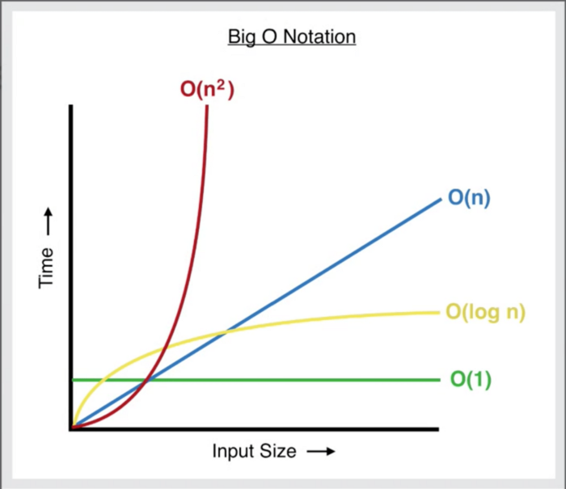

# Algorithm

> /ˈalɡərɪð(ə)m/
>
> *noun*
>
> a process or set of rules to be followed in calculations or other problem-solving operations, especially by a computer.
"a basic algorithm for division"

### Learning Objectives
- Describe the complexity of common algorithms using Big O notation
- Explain the difference between **O(1)**, **O(N)**, **O(N²)** & **O(2^N)**
- _coming soon:_ **O(log N)**, **O(N!)**

### Complexity

Efficiency of an algorithm depends on two parameters:

1. Time Complexity
2. Space Complexity

Both are calculated as the function of input size(n).

`Time Complexity:` Time Complexity is defined as the number of times a particular instruction set is executed rather than the total time is taken. It is because the total time taken also depends on some external factors like the compiler used, processor’s speed, etc.

`Space Complexity:` Space Complexity is the total memory space required by the program for its execution.


We use a mathematical notation to show the complexity of algorithms called **Big O**.




#### O(1)
**O(1)** describes an algorithm that will always execute in the same time (or space) regardless of the size of the input data set.

```js
const isListElementZero = (list, index) => {
  return list[index] === 0
}
```

#### O(N)
**O(N)** describes an algorithm whose performance will grow linearly and in direct proportion to the size of the input data set. Remember, regardless of how early the algorithm _might_ return, always consider the worst-case performance scenario. Big O notation will always assume the upper limit where the algorithm will perform the maximum number of iterations.

```js
const loopOne = (list) => {
  return list.map(item => item**2)
}

const loopTwo = (list) => {
  return list.filter((item, index) => {
    if (index < list.length / 2) return item
  })
}
```

Additionally, this example below is still **O(N)**. You might record it as **0(N/2)**, but Big O always considers inputs large enough that constants aren't significant, so they can be ignored.
```js
const loopThree = (list) => {
  let text = ''
  for (let i = 0; i < list.length; i++) {
    if (i > list.length / 2) { break }
    text += `The number is ${i} `
  }
  return text
}
```

#### O(N²)
**O(N²)** represents an algorithm whose performance is directly proportional to the square of the size of the input data set. This is common with algorithms that involve nested iterations over the data set. Deeper nested iterations will result in **O(N³)**, **O(N⁴)** etc.

```js
const nestedLoop = (list) => {
  const vowels = ['a', 'e', 'i', 'o', 'u']
  return list.map(item => {
    return item.split('').filter(char => {
      if (vowels.includes(char)) return char
    })
  })
}
```


#### O(2^N)
**O(2^N)** denotes an algorithm whose growth doubles with each addition to the input data set. The growth curve of an **O(2^N)** function is exponential — starting off very shallow, then rising meteorically. An example of an **O(2^N)** function is the recursive calculation of Fibonacci numbers:

```js
const fibonacci = (num) => {
  if (num <= 1) return num
  return fibonacci(num-2) + fibonacci(num-1)
}
```
